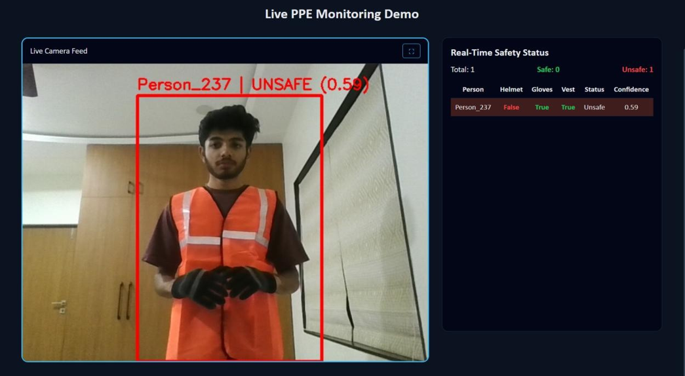

# PPE Detection System

This project is an AI-powered computer vision system designed to monitor Personal Protective Equipment (PPE) compliance in real time.  
The system detects whether workers are wearing essential safety equipment such as helmets, gloves, and safety vests.

## Overview

The project uses deep learning and computer vision techniques to identify safety compliance in industrial environments.

The system can:
- Detect workers in real time
- Identify PPE equipment
- Mark workers as SAFE or UNSAFE
- Display live monitoring results with confidence scores

It can be used in:
- Factories
- Construction sites
- Warehouses
- Industrial safety monitoring systems

## Features

- Real-time PPE detection
- Helmet, gloves, and vest monitoring
- SAFE / UNSAFE worker classification
- Live dashboard monitoring
- Confidence score display
- Computer vision-based safety automation
- Modular and extendable architecture

## Benefits

- Helps reduce workplace accidents
- Improves industrial safety compliance
- Reduces manual safety monitoring
- Enables real-time violation detection
- Can integrate with CCTV and surveillance systems
- Promotes safer working environments

## Tech Stack

- Python
- TensorFlow / Keras
- OpenCV
- NumPy
- Flask
- YOLO (Ultralytics)

## Project Structure

- `train_model.py` – Model training script
- `test_model.py` – PPE detection testing
- `model/` – Trained model files
- `screenshots/` – Project preview images
- `requirements.txt` – Project dependencies

## Detection Results

<p align="center">
  
  
</p>

The system performs real-time PPE compliance monitoring using computer vision and deep learning.

- Safe workers are identified when all required safety equipment is detected.
- Unsafe workers are highlighted instantly if any mandatory PPE is missing.
- The dashboard displays real-time safety status and confidence scores.

## Installation

```bash
git clone https://github.com/dhruvrupavatiya006/PPE-Detection-model.git
cd PPE-Detection-model
