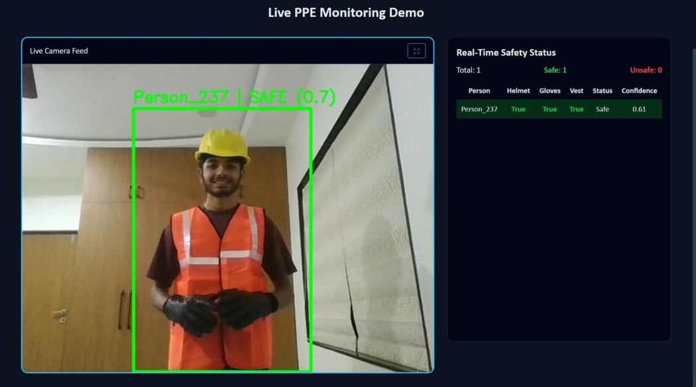

# PPE Detection Model

This project is a computer vision-based system that detects whether a person is wearing personal protective equipment (PPE), such as a face mask.

## Overview

The model uses deep learning techniques to classify images into two categories:
- With Mask
- Without Mask

It can be used for safety compliance in workplaces, public areas, and industrial environments.

## Features

- Real-time face mask detection  
- Image classification using a trained model  
- Simple and modular code structure  
- Easy to test and extend  

## Benefits

- Helps prevent accidents in industrial environments  
- Ensures safety compliance among workers  
- Reduces manual monitoring effort  
- Can be integrated with surveillance systems  
- Promotes a safer and more responsible workplace  

## Tech Stack

- Python  
- TensorFlow / Keras  
- OpenCV  
- NumPy
  
## Project Structure

- `train_model.py` – Model training script  
- `test_model.py` – Testing the trained model  
- `model/` – Saved trained model  
- `requirements.txt` – Dependencies  

## Project Preview

## Project Preview



## Project Preview


## Installation

Clone the repository:

```bash
git clone https://github.com/dhruvrupavatiya006/PPE-Detection-model.git
cd PPE-Detection-model
